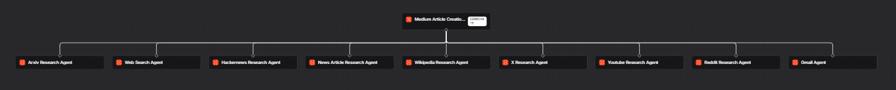

# 🚀 ResearchForge AI

**A multi-agent AI research & content generation system** that gathers insights from multiple sources 🌐, intelligently orchestrates specialized agents 🤖, and transforms research into engaging, Medium-ready articles ✍️ using **Agno**.



## 🔎 Overview

ResearchForge AI is an **agentic AI research and content generation system** built with **Agno**.

It uses specialized AI agents to collect information from different platforms such as **ArXiv, Web Search, Hacker News, Wikipedia, X, YouTube, Reddit, and news articles**. A central **Team Orchestrator** coordinates these agents, combines the research, and generates a structured Medium-style article.

The system also includes a **Gmail Agent** for email-related tasks and supports saving confirmed articles as Markdown files.

## 🏗️ Architecture

```text
                         User
                           │
                           ▼
                ┌─────────────────────┐
                │   Team Orchestrator │
                │   GPT-OSS-120B      │
                └──────────┬──────────┘
                           │
          ┌────────────────┼────────────────┐
          ▼                ▼                ▼
     Research Agents   Content Research   Gmail Agent
          │
    ┌─────┼───────────────────────────────────────┐
    │     │       │       │       │       │       │
  ArXiv  Web   HackerNews News  Wikipedia  X   YouTube
                                           │
                                         Reddit
    └─────────────────────┬─────────────────────────┘
                          ▼
                  Research Synthesis
                          │
                          ▼
                Medium Article Draft
                          │
                    User Approval
                          │
                          ▼
                   Markdown File
                   medium_articles/
```

## 🤖 Specialized Agents

| Agent                  | Responsibility                             |
| ---------------------- | ------------------------------------------ |
| **ArXiv Agent**        | Research papers, authors & academic topics |
| **Web Search Agent**   | Recent web information and sources         |
| **Hacker News Agent**  | Latest technology discussions              |
| **News Article Agent** | Reads and summarizes online articles       |
| **Wikipedia Agent**    | General knowledge and topic research       |
| **X Agent**            | Posts and engagement metrics               |
| **YouTube Agent**      | Videos, transcripts & metadata             |
| **Reddit Agent**       | Community discussions and posts            |
| **Gmail Agent**        | Draft, search, read and send emails        |

## 🔄 Workflow

1. **User provides a topic**
2. **Team Orchestrator analyzes the request**
3. Relevant specialized agents perform research
4. Research findings are **aggregated and synthesized**
5. Orchestrator generates a **Medium-ready article**
6. User reviews the generated draft
7. After confirmation, the article is saved as a **Markdown (`.md`) file**

## 🧠 Key Features

* Multi-agent research architecture
* Specialized agents for different information sources
* Centralized **Agno Team orchestration**
* Research synthesis and Medium-style content generation
* Web and academic research capabilities
* YouTube transcript and metadata analysis
* Reddit and X research
* Gmail integration
* Human-in-the-loop article approval
* Markdown article generation
* AgentOS-based application serving
* Conversation history support

## 🛠️ Tech Stack

**Agno, Agno Team, AgentOS, Groq, GPT-OSS-120B, GPT-OSS-20B, Python, ArXivTools, WebSearchTools, DuckDuckGoTools, HackerNewsTools, Newspaper4kTools, WikipediaTools, XTools, YouTubeTools, RedditTools, GmailTools, LocalFileSystemTools, InMemoryDb, python-dotenv**

## 📁 Project Structure

```text
ResearchForge-AI/
│
├── app.py
├── flow.png
├── .env
│
├── research_papers/
│   └── ...
│
├── medium_articles/
│   └── ...
│
└── README.md
```

### 📂 Output Directories

* `research_papers/` → Stores downloaded research papers from ArXiv.
* `medium_articles/` → Stores approved Medium articles in Markdown format.

## ⚙️ Setup

### 1. Clone the repository

```bash
git clone <your-repository-url>
cd ResearchForge-AI
```

### 2. Create a virtual environment

```bash
python -m venv .venv
```

Activate it:

**Windows**

```bash
.venv\Scripts\activate
```

**Linux/macOS**

```bash
source .venv/bin/activate
```

### 3. Install dependencies

```bash
pip install -r requirements.txt
```

### 4. Configure environment variables

Create a `.env` file:

```env
GROQ_API_KEY=your_groq_api_key
```

Configure Gmail OAuth credentials separately if Gmail functionality is required.

### 5. Run the application

```bash
python app.py
```

## 🎯 Why ResearchForge AI?

ResearchForge AI demonstrates how **agentic AI can divide complex research workflows into specialized tasks**, coordinate multiple autonomous agents, synthesize information from diverse sources, and produce useful content with **human approval before final output**.

> **Research → Orchestrate → Synthesize → Generate → Approve → Publish**

## 🚀 Future Scope

* Persistent database and long-term agent memory
* More research and productivity integrations
* Improved source verification and citation handling
* Automated content publishing
* Advanced observability and agent monitoring
* Production-ready deployment and authentication

---

### 👨‍💻 Built With

**Python • Agno • Groq • AgentOS • Multi-Agent Systems • Generative AI**
